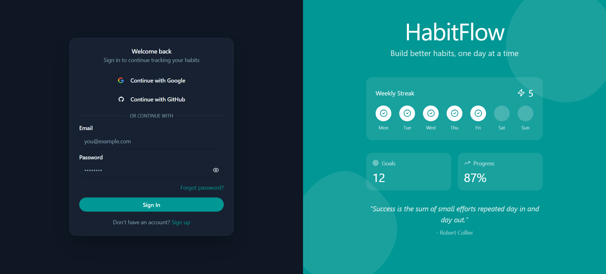
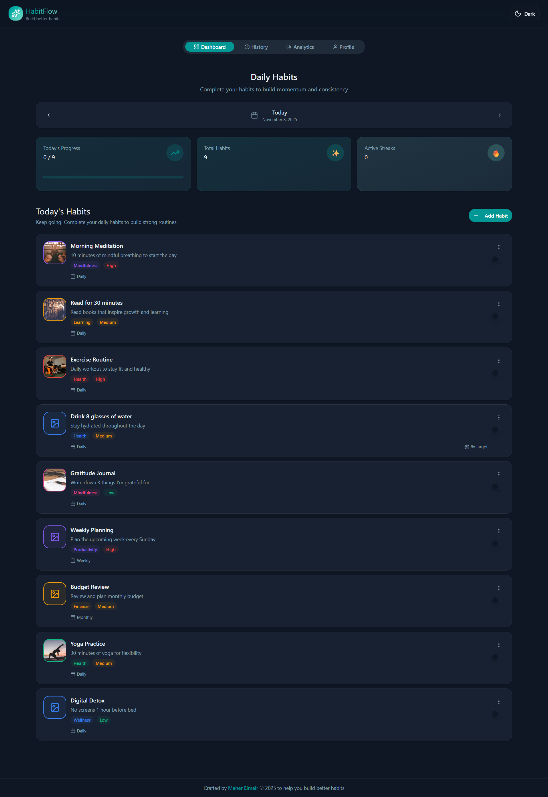
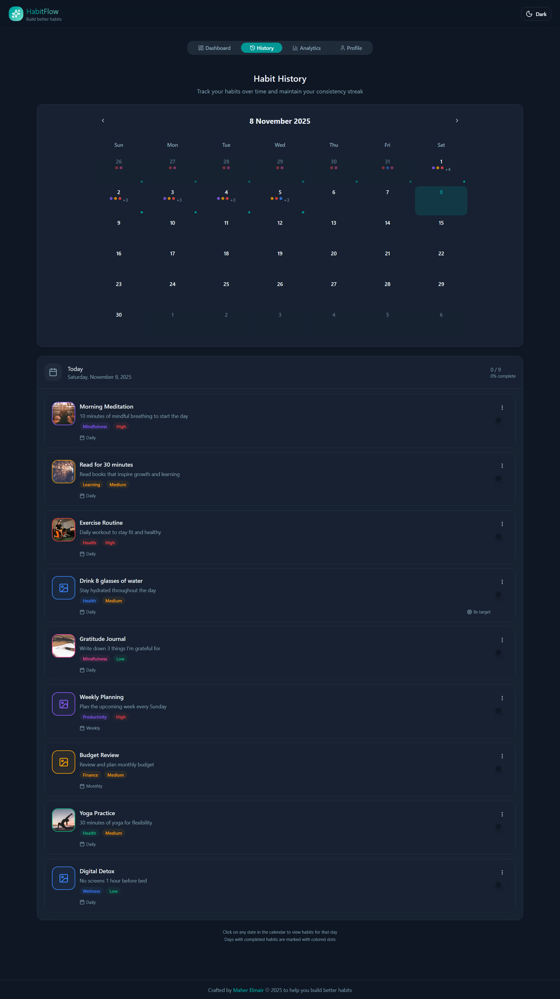
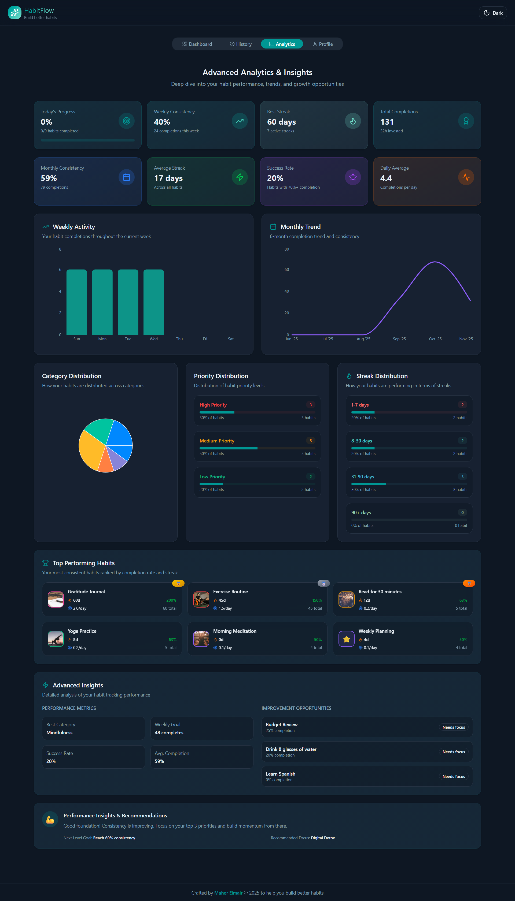
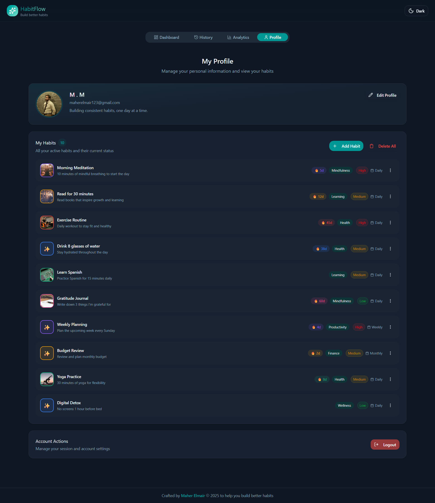

<h1 align="center">🌟 HabitFlow - Modern Habit Tracking Application</h1>

<p align="center">
  <em>A beautiful, powerful, and modern habit tracking app to help you stay consistent, analyze progress, and build better habits.</em>
</p>

<p align="center">
  
  
  
  
</p>

---

## ✨ Overview

**HabitFlow** is a modern and feature-rich habit tracking app built with **React** and **TypeScript**.
It helps you **build consistent habits**, **analyze progress**, and **track achievements** with a clean, minimal interface.

---

## 📸 Screenshots

### 🔐 Authentication



### 🏠 Dashboard



### 📅 History



### 📊 Analytics



### 👤 Profile



---

## 🛠️ Tech Stack

| Category              | Tools & Libraries                                 |
| --------------------- | ------------------------------------------------- |
| **Core**              | React 19.1.1, TypeScript 5.9.3, Vite 7.1.7        |
| **UI**                | Tailwind CSS, shadcn/ui, Radix UI, Lucide Icons   |
| **State & Forms**     | React Hook Form, Zod, @hookform/resolvers         |
| **Charts**            | Recharts (Bar, Line, Pie charts)                  |
| **Backend / Storage** | Local Storage (primary)                           |
| **Utilities**         | date-fns, dayjs, moment, react-big-calendar       |
| **Routing & UX**      | React Router, Sonner (toast), Motion (animations) |

---

## 📁 Folder Structure

```md
HabitFlow/
├── src/
│   ├── _auth/          # Authentication logic (Local Storage based)
│   ├── _root/          # Main app pages (Home, History, Analytics, Profile)
│   ├── components/     # Reusable UI components
│   ├── hooks/          # Custom React hooks
│   ├── lib/            # Storage utilities (LocalStorage)
│   ├── services/       # Data and logic layer
│   ├── theme/          # Theme management
│   ├── styles/         # Global styles & animations
│   ├── App.tsx
│   └── App.css
└── vite.config.ts
```

---

## 🎯 Core Features

| Feature                    | Description                                                                                                                                    |
| -------------------------- | ---------------------------------------------------------------------------------------------------------------------------------------------- |
| 🔐 **Authentication**      | - Email/password login stored in **Local Storage** <br> - Protected routes & session persistence <br> - Secure logout with confirmation dialog |
| 🧠 **Habit Management**    | - Create, edit, and delete habits <br> - Progress bars & color-coded categories <br> - Custom reminders, priorities, and tags                  |
| 📅 **Calendar & History**  | - Interactive calendar with streak tracking <br> - Visual daily completion insights                                                            |
| 📊 **Analytics Dashboard** | - Visual reports with **Recharts** <br> - Category trends, streaks, and success rates                                                          |
| 👤 **Profile**             | - Custom avatar & bio <br> - Editable personal data                                                                                            |

---

## 🎨 Design System

| Feature                  | Description                   |
| ------------------------ | ----------------------------- |
| 🌗 **Dark/Light Mode**   | Seamless theme switching      |
| ♿ **Accessible UI**     | Built using Radix primitives  |
| 📱 **Responsive Design** | Optimized for all devices     |
| ✨ **Smooth Animations** | Motion + Tailwind transitions |

---

## 🔒 Security

| Feature                 | Details                                       |
| ----------------------- | --------------------------------------------- |
| 🔐 **Authentication**   | Local Storage based (secure for personal use) |
| 📝 **Validation**       | Zod-based validation                          |
| 🛡 **Protected Routes**  | Auth-protected routes                         |
| 🔒 **Sanitization**     | XSS & input sanitization                      |

---

## 📈 Roadmap

| Upcoming Features           | Status / Notes          |
| ----------------------------| ----------------------- |
|  React Native app version   | Mobile version          |
|  Push notifications         | Habit reminders         |
|  Habit challenges & sharing | Social features         |
|  CSV / PDF data export      | Export habits & reports |
|  AI habit recommendations   | Smart suggestions       |
|  Offline PWA mode           | Full offline support    |

---

## 🚀 Quick Start

```bash
git clone https://github.com/Maher-Elmair/habitflow.git
cd habitflow
npm install
npm run dev
```

---

### 👨‍💻 Author

**Maher Elmair**

* 📫 [maher.elmair.dev@gmail.com](mailto:maher.elmair.dev@gmail.com)
* 🔗 [LinkedIn](https://www.linkedin.com/in/maher-elmair)
* ✖️ [X (Twitter)](https://x.com/Maher_Elmair)
* ❤️ Made with passion by [Maher Elmair](https://maher-elmair.github.io/My_Website)

---

## 🌐 Live Demo

🚀 **Try it now on Vercel:**
👉 [habitflow.vercel.app](https://habit-flow-gold.vercel.app/)

---

🙌 **Thank you for visiting!**
If you liked the project, please ⭐ the repository!  
Contributions, feedback, and PRs are always welcome 🙏
# Jatan
